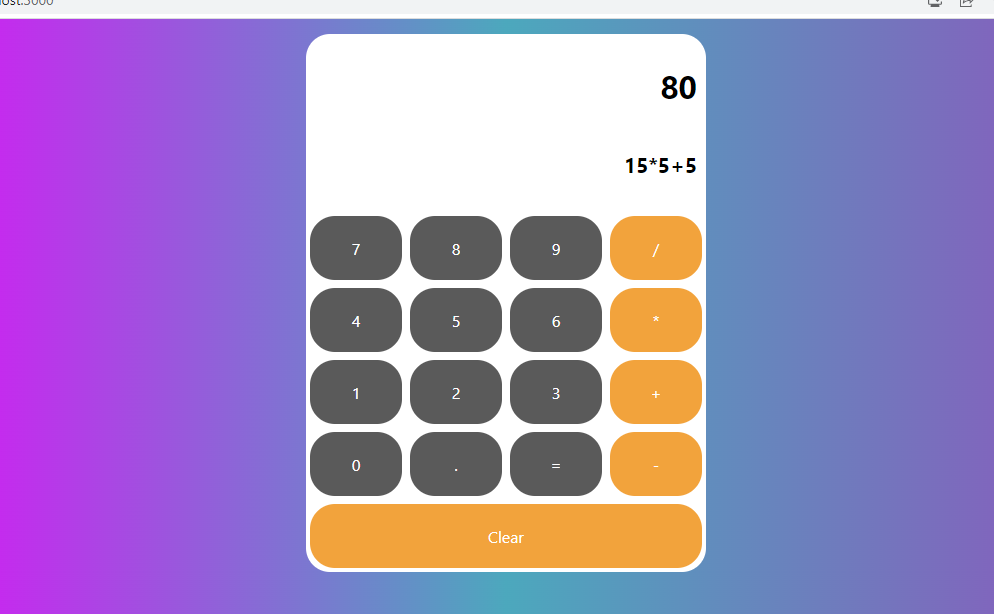

# React Calculator App

A simple calculator application built with React.js.

# Demo

https://react-calculator-seven-omega.vercel.app/

# Features

The main features of this calculator app are:

-Perform basic arithmetic operations (+, -, *, /)
-Display real-time input and result

# Image of App

